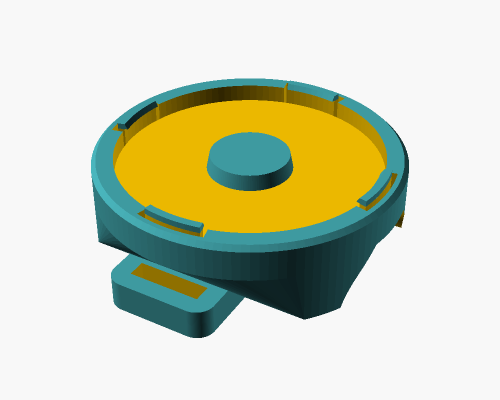
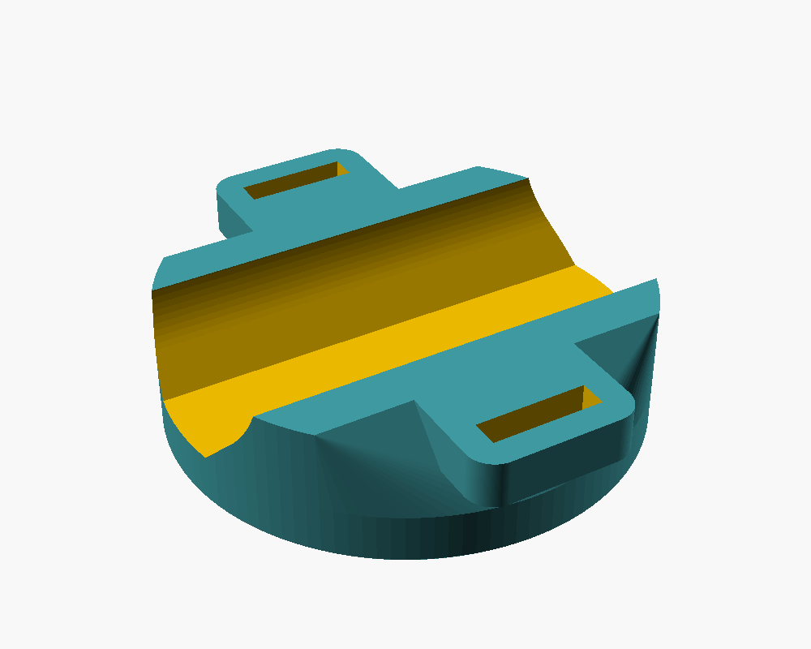

# Trolleyhalter für GPS mit Magnet

3D-druckbarer Halter, um ein GPS-Gerät mit Magnet-Rückseite am Rohr eines
(Golf-)Trolleys zu befestigen. Als Haftfläche für den Magneten dient eine
eingeklickte Stahl-Beilagscheibe, befestigt wird der Halter mit Kabelbindern.

| Oben (Scheibenaufnahme) | Unten (Sattel + Ösen) |
|---|---|
|  |  |

## Aufbau

- **Scheibenaufnahme:** Tasche für die Beilagscheibe mit Zentrierzapfen und
  vier federnden Schnapplaschen. Die Scheibe wird von oben eingedrückt und
  rastet ein.
- **Sattel:** Angepasst an den Rohrdurchmesser, damit der Halter nicht verdreht.
- **Ösen:** Je eine breite Öse links und rechts vom Rohr. Der Kabelbinder läuft
  durch beide Ösen und um das Rohr.

## Benötigte Teile

- Stahl-Beilagscheibe 44 × 14,5 × 3 mm (Karosseriescheibe, z. B. DIN 9021 M14)
- 1 Kabelbinder, bis 12 mm breit (alternativ 20 mm Klettband, siehe unten)

## Dateien

| Datei | Inhalt |
|---|---|
| [`OpenSCAD/trolleyhalter.scad`](OpenSCAD/trolleyhalter.scad) | Parametrisches Modell |
| [`OpenSCAD/trolleyhalter.stl`](OpenSCAD/trolleyhalter.stl) | Fertig exportiert für die Standardmaße |
| [`input/`](input/) | Referenzfotos (Beilagscheibe, alter Halter) |
| [`docs/`](docs/) | Vorschaubilder |

## Anpassen

Alle Maße stehen oben in der `.scad`-Datei und lassen sich auch im
OpenSCAD-Customizer ändern. Die wichtigsten:

| Parameter | Standard | Bedeutung |
|---|---|---|
| `tube_d` | 25 | Rohrdurchmesser des Trolleys, **vor dem Druck nachmessen** |
| `pad_t` | 0 | Dicke einer Gummi-Zwischenlage (z. B. 1) |
| `washer_d` / `washer_hole` / `washer_t` | 44 / 14,5 / 3 | Maße der Beilagscheibe |
| `fit_clear` | 0,3 | Spiel der Scheibe in der Tasche |
| `lip_in` / `clip_t` | 0,6 / 1,2 | Rastnase / Laschendicke: kleiner = leichter einklicken |
| `strap_w` / `strap_t` | 12 / 3 | Ösenloch; für 20 mm Klettband: 22 / 3,5 |
| `eyelet_count` | 1 | Ösen pro Seite (1 = mittig, 2 = vorne + hinten) |

Nach Änderungen in OpenSCAD mit **F6** rendern und als STL exportieren, oder per
Kommandozeile:

```sh
openscad -o OpenSCAD/trolleyhalter.stl OpenSCAD/trolleyhalter.scad
```

## Drucken

- Ausrichtung wie in der STL: Sattel auf dem Druckbett, Scheibenaufnahme oben
- **Keine Stützstrukturen** nötig
- Material: PETG oder ASA (PLA wird in der Sonne bzw. im Auto weich)
- 0,2 mm Schichthöhe, 3 Wände, 30–40 % Füllung
